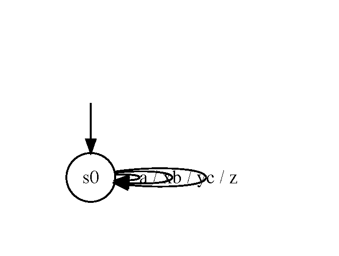
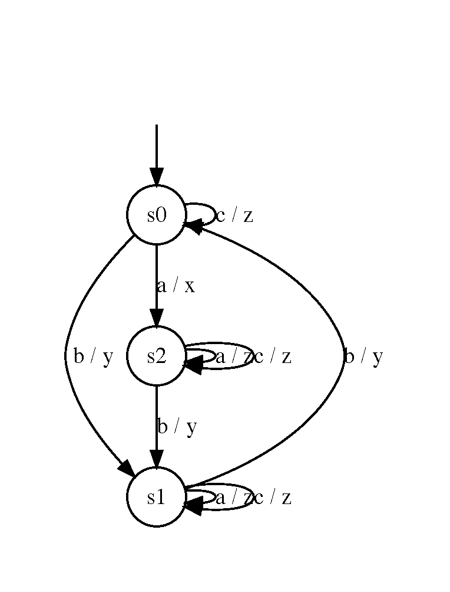
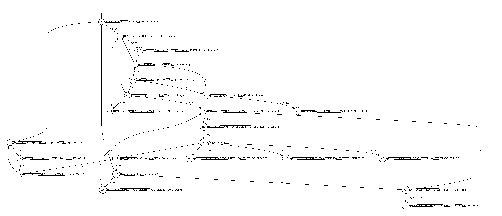

# Learning models for programs of the RERS challenge

This repo contains a basic setup for learning Mealy machine models of programs from the RERS challenge using the L* algorithm. It makes use of LearnLib ( http://learnlib.de/), a library for active model learning. A hassle-free, compiled version of the library has been added to this repository for convenience (getting started with LearnLib from their GitHub repo can be a bit confusing, because the library is not very well documented).

## Setup

Download and install the following before starting:
- Java SDK 1.8
- Graphviz, which contains the `dot` utility for visualizing the learned models, you need the command line tools, install using brew or apt-get or another package manager:

```
brew install graphviz
```

We recommend that you work inside an IDE for this project (as opposed to the CLI), as the different parameters for learning are hard-coded in the sources.

Importing the sources in your IDE of choice should be straightforward. Make sure to include `learnlib.jar` as a dependency. I have used JDK 1.8, but I think 1.7 should suffice.

The file `ExampleExperiment` contains a `main` method that learns a Mealy machine for the system described in `ExampleSUL`:

```Java
	public String makeTransition(String input) {
		switch (currentState) {
		case s0:
			switch(input) {
			case "a":
				currentState = State.s1;
				return "x";
			case "b":
				currentState = State.s2;
				return "y";
			case "c":
				return "z";
			}
		case s1:
			switch(input) {
			case "a":
				return "z";
			case "b":
				currentState = State.s2;
				return "y";
			case "c":
				return "z";
			}
		case s2:
			switch(input) {
			case "a":
				return "z";
			case "b":
				currentState = State.s0;
				return "y";
			case "c":
				return "z";
			}
		}
		throw new SULException(new IllegalArgumentException("Argument '" + input + "' was not handled"));
	}
```

When you run `ExampleExperiment.main()`, you should see the following output:

```
RERSLearner.ExampleExperiment

model size 1
0: Fri Mar 17 15:24:10 CET 2017
Hypothesis size: 1 states
learning queries/symbols: 3/3(3/3 this learning round)
testing queries/symbols: 4/6(1/3 this testing round)

model size 3
1: Fri Mar 17 15:24:10 CET 2017
Hypothesis size: 3 states
learning queries/symbols: 25/65(21/59 this learning round)
testing queries/symbols: 57/365(32/300 this testing round)

Finished learning!

Process finished with exit code 0
```

The learner should also have created the files `hypothesis0.dot`, `hypothesis0.pdf`, `hypothesis1.dot`, `hypothesis1.pdf`, `model.dot` and `model.pdf` in your working directory. If you do not see the pdf files, this means that the `dot` tool is not installed correctly --- so install the graphviz library again. Take a look at the first pdf file:



And the second:



Do you see how the second hypothesis is a refinement of the fist? Do you see how the second model relates to the code in `ExampleSUL`?

You are now ready to start working on the RERS problems.

## The RERS problems

We are going to learn models for the RERS 2016 or 2017 programs. These programs are not included in the sources, but you should have already seen them in previous assignments. For this assignment, we are going to use the binaries compiled from the C sources (although the Java sources should also work). Learning is a black-box technique, after all. Instead of the stderr used for AFL and KLEE, we are going to use only stdout for output. Furthermore, LearnLib assumes that the SUT (software under test) is a reactive system that always produces some output for a given input. Consequently, the SUT should not crash because then LearnLib will wait infinitely for the output. Make sure the RERS code is as follows:

```C
void __VERIFIER_error(int i){
        printf("ERROR %d\n", i);
        fflush(stdout);
}
```

and


```
    errorCheck();

    if( cf==1 ){
    	fprintf(stderr, "Invalid input: %d\n", input);
        fflush(stdout);        
    } 
}

int main()
{
	// main i/o-loop
	while (1) {
		// read input
		int input = 0;
		int ret = scanf("%d", &input);
		if (ret != 1) return 0;
    if((input != 1) && (input != 2) && (input != 3) && (input != 4) && (input != 5)) return 0;
		// operate eca engine
		calculate_output(input);
	}
}
```

A learning setup (similar to the one you have seen before) can be found in `RERSExperiment`. Instead of using the example as a System Under Learning (SUL), this method uses `ProcessSUL` to connect with the RERS binaries. In `RERSExperiment.main()`, make sure to point the `ProcessSUL` to your compiled RERS binary, e.g., replace:

```
        SUL<String,String> sul = new ProcessSUL(PATH_TO_BINARY);
```

by

```
        SUL<String,String> sul = new ProcessSUL("/Users/sicco/STR_20162017/ReachabilityRERS2017/Problem10/a.out");
```


In learning, you have to specify the input alphabet that the learner uses. This can be quite tricky in case of for isntance reversing network protocols. The automaton learning experience (ALEX http://learnlib.github.io/alex/) contains a neat way of defining these inputs when elarning models from webpages. Fortunately, in our case, this is straightforward, as it is specified at the top of the RERS source code. Change the following line if your RERS program uses more than 5 inputs:

```
        // the input alphabet
        Collection<String> inputAlphabet = ImmutableSet.of("1","2","3","4","5");
```

Then run `RERSExperiment.main()`. In my case, this gives the following model:



But you can get much larger models by changing the behavior of the process. Modify line 28 in RERSExperiment:

```
        BasicLearner.runControlledExperiment(sul, BasicLearner.LearningMethod.TTT, BasicLearner.TestingMethod.RandomWalk, inputAlphabet);
```

e.g., in:

```
        BasicLearner.runControlledExperiment(sul, BasicLearner.LearningMethod.LStar, BasicLearner.TestingMethod.WMethod, inputAlphabet);
```

The different settings for the learner can be found in `BasicLearner`. Have a look and try different settings. What is the largest model you can find? Which settings are good, can you find out why?

Happy learning!

